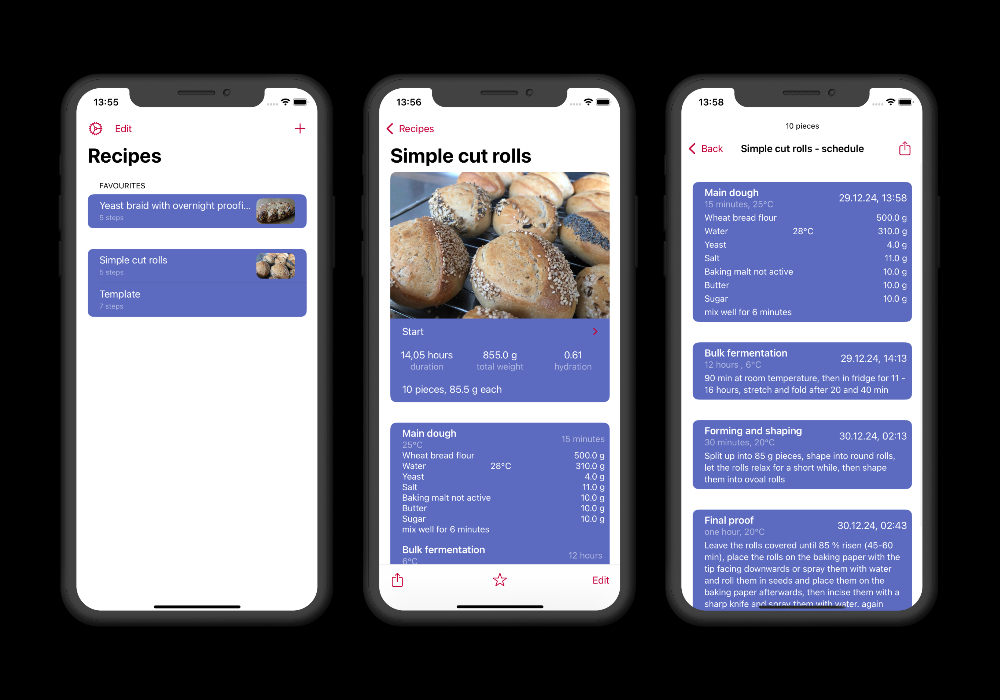
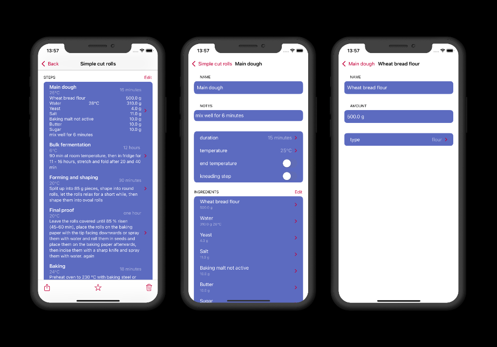

#  BackApp
free and open sourceRecipe database and baking planner focused on bread baking
 

 

## Features
The BakingApp manages your recipes and allows you to create schedules with the right quantities of ingredients and temperatures for the baking day, you can also export and import recipes to share them with friends or acquaintances.

### Recipe management

The BackApp saves your recipes locally on your device in a database. The recipes can be exported/imported at any time in a separate file format

### Recipe input
Recipes are stored with their steps and ingredients. In addition, steps can have other steps as substeps. This is for example useful for starter doughs.
The BackApp calculates the required temperature of bulk liquids, usually water, taking the room temperature into account. There is also automatic ingredient type recognition for common ingredient names like water.

### Planning function
With the planning function, you can create the time and quantity planning for a recipe either from the desired completion time or from a start time and then export it. The BackApp creates a schedule with steps, dates and ingredients based on your entries. The quantities of ingredients for the desired number of loaves, rolls, etc. are also calculated. (e.g. there is a recipe with quantities for 10 baguettes, but you only want to make 2 baguettes)

## Contributing
The app's architecture is honestly a complete mess, but in general new features should be implemented with SwiftUI using the MVVM Pattern in a seperate folder for each screen/flow
for storing the data locally grdb v6 is used but it should be migrated to grdb 7 in the near future.   
A Great Place to getting started is writing translations with are all managed in the Strings package
But any PR is welcome. Please merge into devel and not into master. 
At the moment there are a lot of bugs and ui issues just feel free to look around in the issues.

## Donating
The App is available for free in the Apple App Store, but many, many hours of programming work have gone into its development and its publication in the App Store is not for free. If you like the app, we would be very happy to receive a small donation [here](https://www.paypal.com/donate?hosted_button_id=UCSFW65PP6N3U)
 

